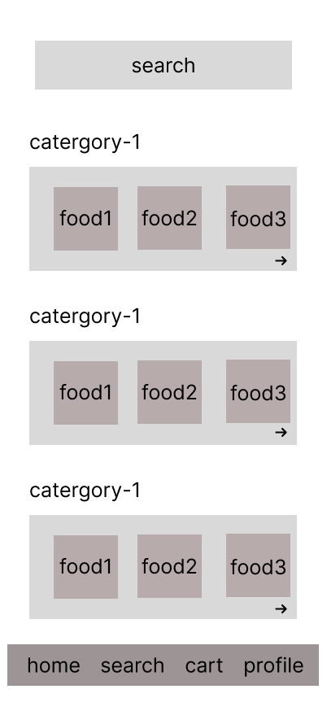
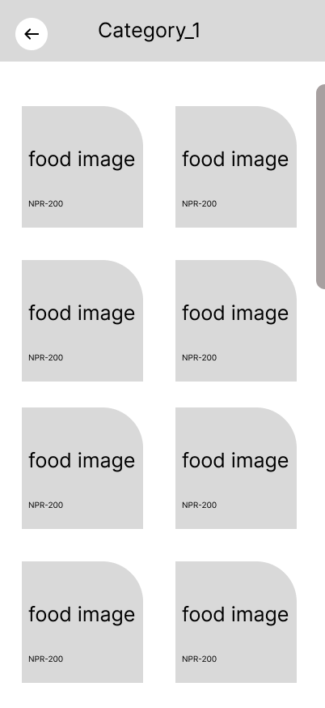
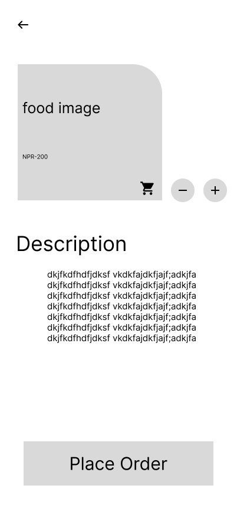

# Food Ordering App - UX Case Study
## Project Overview
Fast Food is a food ordering app designed for users that allows them to order food from any restaurant within a 10 km radius. The app focuses on helping users quickly find and filter food options to place their order faster.

## User Goal
Help users filter food options by price or restaurant, so they can easily order what they want.

## Wireframe Decisions
-Search bar placed at top for quick access
-Food images shown prominently to support fast visual decisions
-Bottom navigation used to follow common user habits
-Limited features on the first screen to avoid clutter and confusion.

## Wireframe

### HOME SCREEN

### Category Screen

### Food Detail Screen

## Category Screen

The category screen displays a grid layout of food items within a selected category.
The goal of this screen is to help users scan options quickly and compare items without cognitive overload.

Each card includes:

Food image for quick visual recognition

Price information to support fast decision-making

A simple grid layout was chosen to maintain consistency and allow users to browse multiple items efficiently.

## Food Details Screen

The food details screen provides users with complete information about a selected item before placing an order.

This screen includes:

Large food image to build trust and appetite appeal

Clear price visibility

Item description to help users understand ingredients or portion details

Quantity controls (+ / −) for easy customization

A fixed “Place Order” button to encourage conversion

The layout prioritizes clarity and action, ensuring users can place an order with minimal friction.
